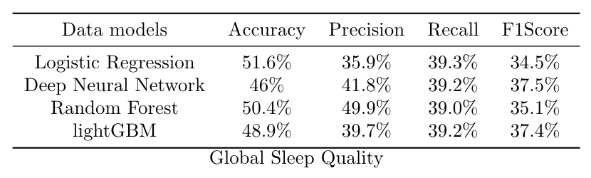
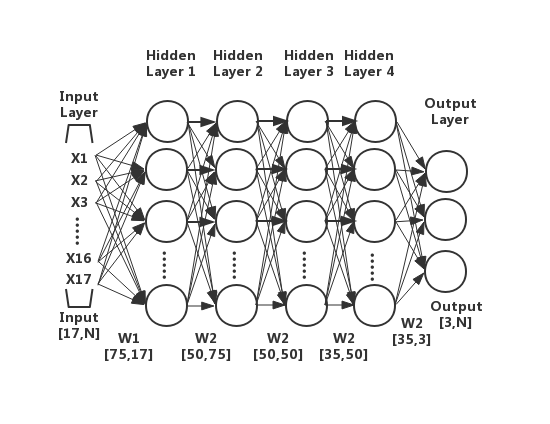

# Sleep Quality By Polysomnography

> Haipeng LI, Lucas MONTI

## Introduction
Our project is divided into three phases:
1. Convert row polysomnography signals to sleep stages.
2. Data mining process on SHHS core datas.
3. Design of sleep quality evaluation model
## Getting Started


## Sleep Dataset

A short overview of useful sleep datasets

| Abbreviation                                                                                                                                 | Study Name                                     | Recordings | Condition            |
|----------------------------------------------------------------------------------------------------------------------------------------------|------------------------------------------------|------------|----------------------|
| [EDFx](https://physionet.nlm.nih.gov/pn4/sleep-edfx/)                                                                                        | The Sleep-EDF Database                         | 153         | healthy              |      
| [SHHS](https://sleepdata.org/datasets/shhs) | Multi-cohort study focused on sleep-disordered breathing and cardiovascular outcomes. | 5804 | healthy&insomnia patients |        
| [more see here...](http://1uc15120fenp48is1xxuutiq-wpengine.netdna-ssl.com/wp-content/uploads/2018/04/Publicallyavailablesleepdatasets.xlsx) |                                                |            |                      


## Sleep Scoring

We choose a open-source library named `AutoSleepScorer` from https://github.com/skjerns/AutoSleepScorer to carry out the sleep staging process, because it's easy to leverage the pre-train model to test your own dataset.

At the same time, we have another choice: `Deepsleepnet` from https://github.com/akaraspt/deepsleepnet which extracts features from row-EEG, but it lacks a pre-trained model, so we need it train the entire model ourselves.

### 1. Install Anaconda
Download and install Anaconda with Python 3.6 64 bit from https://www.anaconda.com/download/#download

If you already have a working Python 3.x environment with Anaconda you can skip this step.

### 2. Install Git
To install git, use: `conda install git`

### 3. Set a Virtual Environment
Open a command line and input: `conda create -n your_env_name python=3.6`.

To activate this environment, use: `source activate your_env_name`

To deactivate an active environment, use: `source deactivate`

### 3. Configure the Environment
#### requisites

```
Python3
Keras
Tensorflow
Numpy
Pandas
Sklearn
Matplotlib
```
Firstly clone our project: `git clone https://github.com/lhaippp/Measuring-Sleep-Quality` 

Next enter the project: `cd Measuring-Sleep-Quality`

To configure the environment, use `chmod +x set-environment.sh` and `source set-environment.sh`

If success, you'll see a result like below:
```
****************************************************************
Congratulations! All the environment are installed successfully
****************************************************************
Now you can view and edit the project!
****************************************************************
```

### 4. Install AutoSleepScorer
Clone and install this repository via pip:
`pip install git+https://github.com/skjerns/AutoSleepScorer`


## **Mini example**

First of all, we need to open jupyter notebook, because we want to see the result of sleep staging: `jupyter notebook`. Then create a python3 file

Then we download a sample file from the EDFx database

```Python
from sleepscorer import tools
# download sample EEG file from the EDFx database
tools.download('https://physionet.org/physiobank/database/sleep-edfx/sleep-cassette/SC4001E0-PSG.edf', 'sample-psg.edf')
# download corresponding hypnogram for comparrison of classification
tools.download('https://pastebin.com/raw/jbzz16wP', 'sample-psg.groundtruth.csv') 
```
Now we can start the Scorer using a list of EEG files.
Instead of an EEG-filename we can also set advanced options using a `SleepData` object
```Python
# create a SleepData object 
from sleepscorer import tools
from sleepscorer import Scorer, SleepData
file = SleepData('sample-psg.edf', start = 2880000, stop = 5400000, 
							  channels={'EEG':'EEG Fpz-Cz', 'EMG':'EMG submental', 
                              			'EOG':'EOG horizontal'}, preload=False)
# Create and run Scorer
scorer = Scorer([file], hypnograms=True, demo=True)
scorer.run()
# this will only work if you have matplotlib set-up
tools.show_sample_hypnogram('sample-psg.groundtruth.csv', start=960, stop=1800)
```
The predictions will now be saved as `sample-psg.edf.csv`, where each row corresponds to one epoch (0=W, 1=S1, 2=S2, 3=SWS, 4=REM).

## **Classification example**


For quick classification

```Python
from sleepscorer import Scorer
file = "eeg_filename" #link to the EEG header or EEG file
scorer = Scorer([file], hypnograms=True)
scorer.run()
```

## Example for Biosignal+
We can collect data from Biosignal plus which contains signals EEG, ECG, and EMG, but this machine cannot collect EOG datas, so the first solution is to replace EOG with ECG, but it affects the performance of our sleep staging algorithm, and we'd like to retrain a new neural network in the future. What's more we can export the data in the format .txt or in the format .edf. And in this part, we provide a peace of code to handle the txt files. Data needs to be sampled with 100 Hz. EEG and EOG are high-pass filtered with 0.15 Hz and the EMG has a high-pass filter of 10 Hz. Data needs to be in the format `[epochs, 3000, 3]` where the last dimension is EEG, EMG and EOG.
```Python
from sleepscorer import Classifier
import numpy as np
bio_signal_plus = np.loadtxt("bio_signal_plus.txt")
# replace with your channel number in the matrix
test = bio_signal_plus[:,["channel one","channel two","channel three"]]
data = test.reshape((epochs,3000,3))
assert(data.ndim==3 and data.shape[1:]==(3000,3))

clf = Classifier()
clf.download_weights()  # skip this if you already downloaded them.
clf.load_cnn_model('./weights/cnn.hdf5')
clf.load_rnn_model('./weights/rnn.hdf5')
preds = clf.predict(data, classes=True)
```

## Core data from SHHS 
We can find a well-processed dataset from https://sleepdata.org/datasets/shhs/files/datasets which contains `5804` rows and `1279` columns. But the problem is that you need write an application to get this dataset, for some authorization reasons, we can't put the data set here, we can only provide the code for processing. If you want to get more details, please have a look at our report here: XXXXXXXX

In order to get an available dataset for the next training step, we need to do data cleaning and feature engineering:
```Python
# Data cleaning
python3 preprocessing.py
```
Now you get a new dataset named `SleepQuality_After_Cleaning.csv`

## Modeling
During this project, we use four models:
* Logistic Regression
* Deep Neural Network 
* Random Forest
* lightGBM

And for each algorithm, we provide 4 different models:
* Global Sleep Quality
* Sleep Quality: light/deep
* Sleep Quality: short/long
* Sleep Quality: restful/restless

Below is the performance of each model in `Global Sleep Quality [bad,ordinary,good]` :




### 1. Deep Neural Network 
Here is the structure of the [DNN](picture/DNN.png)

* to evaluate sleep quality:
```Python
python3 DNN/global_DNN_3.py
```

### 2. Random Forest

* to evaluate quality of sleep light/deep from 3 criterias:
```Python
python3 Random_Forest/global_RF_3.py
```

### 3. lightGBM
* to evaluate quality of sleep light/deep from 3 criterias:
```Python
python3 GBDT/global_lightGBM_3.py
```
