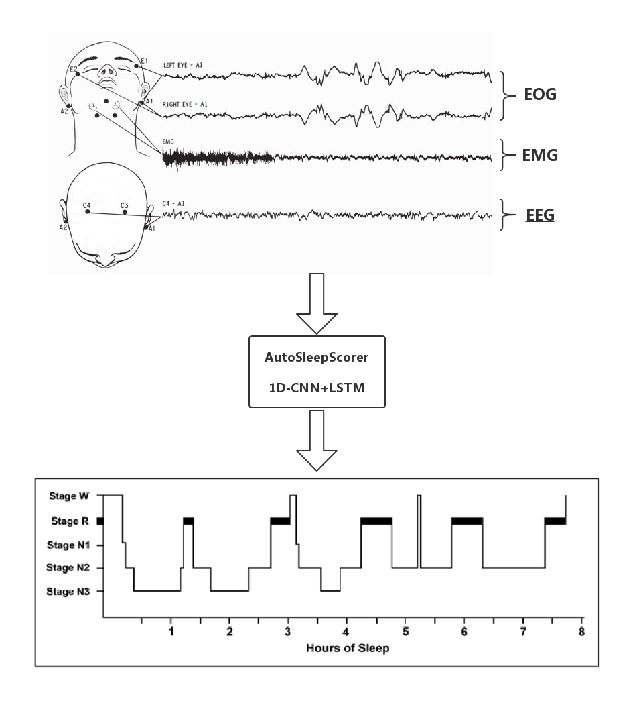
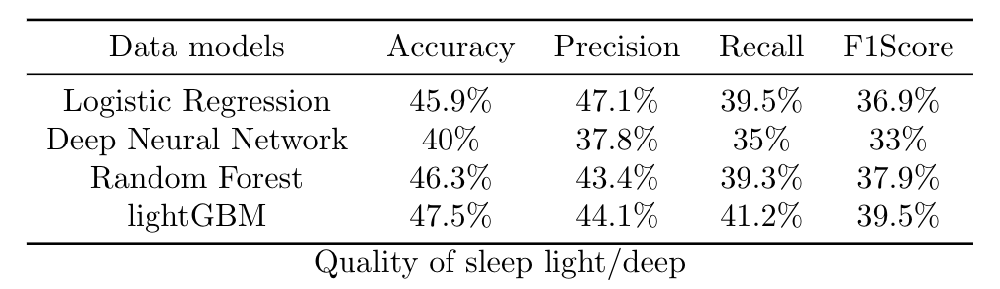
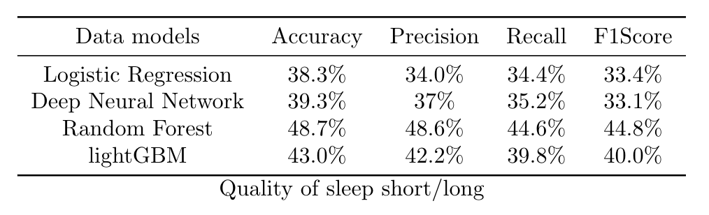
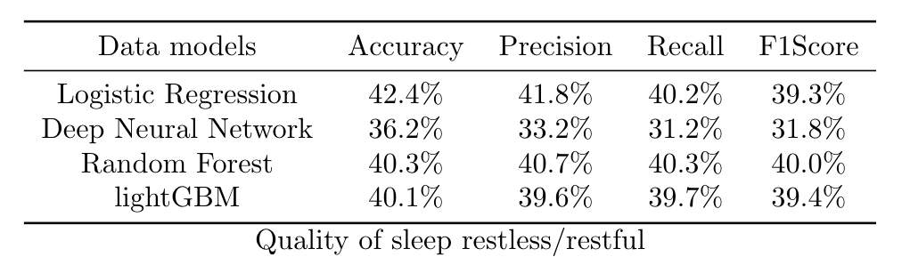
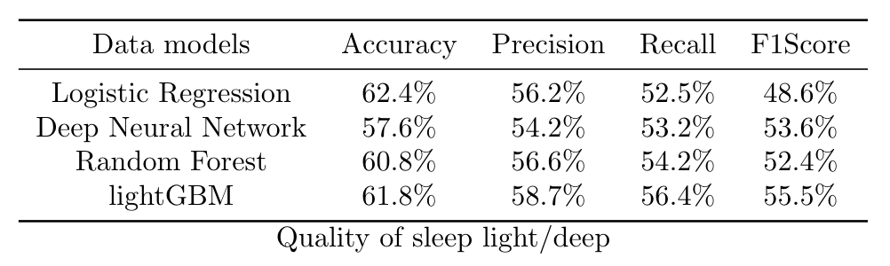
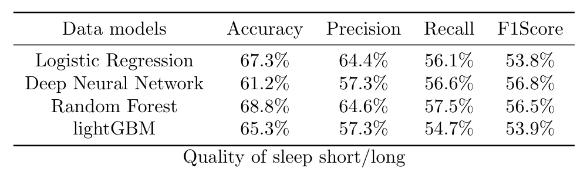
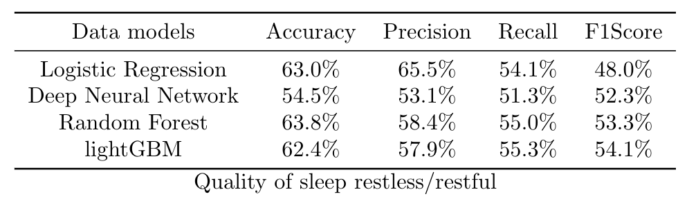
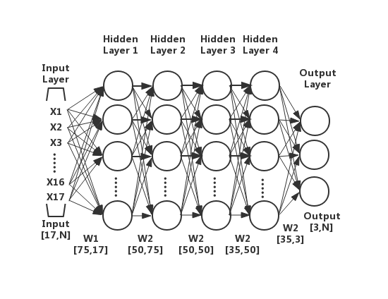
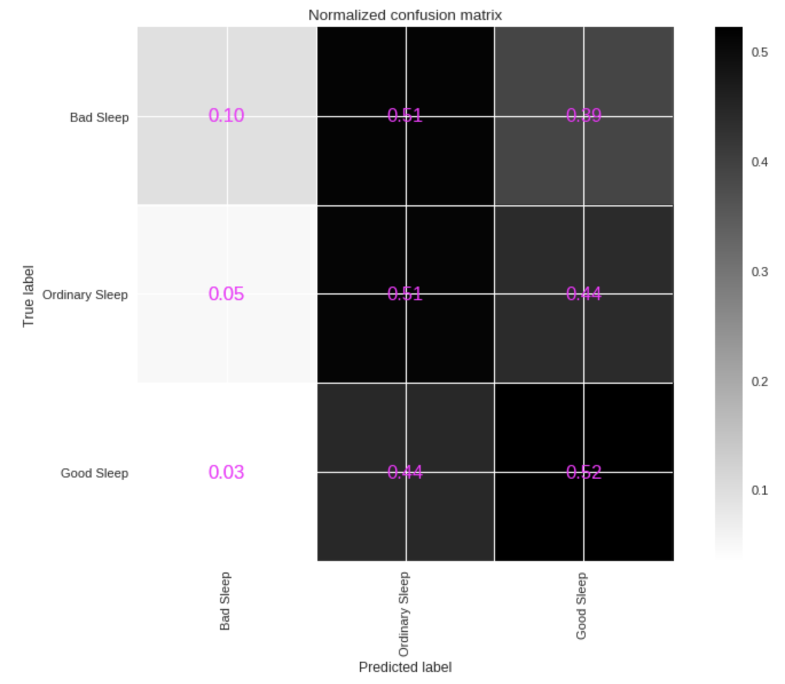
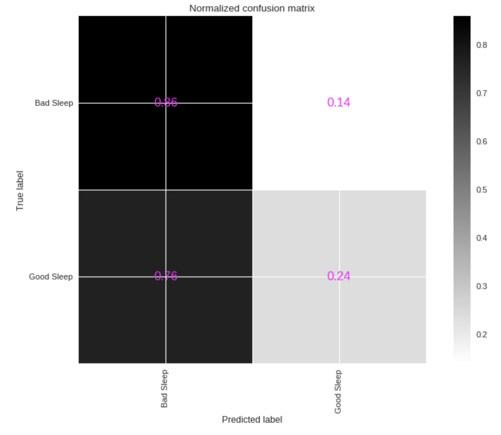

# Sleep Quality By Polysomnography

> Haipeng LI, Lucas MONTI

## Introduction
Our project is divided into three phases:
1. Convert row polysomnography signals to sleep stages.
2. Data mining process on SHHS core datas.
3. Design of sleep quality evaluation model
## Getting Started
### Prerequisites

```
Python3
Keras
Tensorflow
Numpy
Pandas
Sklearn
Matplotlib
```
## Sleep Dataset

A short overview of useful sleep datasets

| Abbreviation                                                                                                                                 | Study Name                                     | Recordings | Condition            |
|----------------------------------------------------------------------------------------------------------------------------------------------|------------------------------------------------|------------|----------------------|
| [CCSHS](https://sleepdata.org/datasets/ccshs)                                                                                                | Cleveland Children's Sleep and Health Study    | 515        | health, young        |
| [ISRUC-SLEEP](https://sleeptight.isr.uc.pt/ISRUC_Sleep/)                                                                                     | ISRUC-SLEEP Dataset                            | 126        | healthy + disordered |
| [EDFx](https://physionet.nlm.nih.gov/pn4/sleep-edfx/)                                                                                        | The Sleep-EDF Database                         | 153         | healthy              |
| [UCDDB](https://physionet.org/pn3/ucddb/)                                                                                                    | University College Dublin Sleep Apnea Database | 25         | sleep apnoe          |
| [DREAMS](http://www.tcts.fpms.ac.be/~devuyst/Databases/DatabaseSubjects/) | The DREAMS Subjects Database | 20 | healthy |             
| [SDRC](https://data.mendeley.com/datasets/3hx58k232n/4) | study on psychophysiological insomnia | 60 | healthy&insomnia patients |       
| [SHHS](https://sleepdata.org/datasets/shhs) | Multi-cohort study focused on sleep-disordered breathing and cardiovascular outcomes. | 5804 | healthy&insomnia patients |        
| [more see here...](http://1uc15120fenp48is1xxuutiq-wpengine.netdna-ssl.com/wp-content/uploads/2018/04/Publicallyavailablesleepdatasets.xlsx) |                                                |            |                      


## Sleep Scoring



We choose a open-source library named `AutoSleepScorer` from https://github.com/skjerns/AutoSleepScorer to carry out the sleep staging process, because it's easy to leverage the pre-train model to test your own dataset.

At the same time, we have another choice: `Deepsleepnet` from https://github.com/akaraspt/deepsleepnet which extracts features from row-EEG, but it lacks a pre-trained model, so we need it train the entire model ourselves.

### 1. Install Anaconda
Download and install Anaconda with Python 3.6 64 bit from https://www.anaconda.com/download/#download

If you already have a working Python 3.x environment you can skip this step.

### 2. Install Tensorflow
Open a command line and install tensorflow via `pip install tensorflow` or via `conda install -c conda-forge tensorflow`.

Personally, I recommend that you install the environment with conda.

### 3. Install AutoSleepScorer
Clone and install this repository via pip:
`pip install git+https://github.com/skjerns/AutoSleepScorer`

If you get an error that`git` is not installed, you can install it using the command line `conda install git`

## **Mini example**

For quick classification

```Python
from sleepscorer import Scorer
file = "eeg_filename" #link to the EEG header or EEG file
scorer = Scorer([file], hypnograms=True)
scorer.run()
```
## **Advanced example**

First we download a sample file from the EDFx database

```Python
from sleepscorer import tools
# download sample EEG file from the EDFx database
tools.download('https://physionet.org/physiobank/database/sleep-edfx/sleep-cassette/SC4001E0-PSG.edf', 'sample-psg.edf')
# download corresponding hypnogram for comparrison of classification
tools.download('https://pastebin.com/raw/jbzz16wP', 'sample-psg.groundtruth.csv') 
```
Now we can start the Scorer using a list of EEG files.
Instead of an EEG-filename we can also set advanced options using a `SleepData` object
```Python
# create a SleepData object 
from sleepscorer import Scorer, SleepData
file = SleepData('sample-psg.edf', start = 2880000, stop = 5400000, 
							  channels={'EEG':'EEG Fpz-Cz', 'EMG':'EMG submental', 
                              			'EOG':'EOG horizontal'}, preload=False)
# Create and run Scorer
scorer = Scorer([file], hypnograms=True, demo=True)
scorer.run()
# this will only work if you have matplotlib set-up
tools.show_sample_hypnogram('sample-psg.groundtruth.csv', start=960, stop=1800)
```
The predictions will now be saved as `sample-psg.edf.csv`, where each row corresponds to one epoch (0=W, 1=S1, 2=S2, 3=SWS, 4=REM).

## **Example for Biosignal+**

We can collect data from Biosignal plus which contains signals EEG, ECG, and EMG, and we can export the data in the format .txt. So in this part, we provide a peace of code to handle it. Data needs to be sampled with 100 Hz. EEG and EOG are high-pass filtered with 0.15 Hz and the EMG has a high-pass filter of 10 Hz. Data needs to be in the format `[epochs, 3000, 3]` where the last dimension is EEG, EMG and EOG.
```Python
from sleepscorer import Classifier
data = ... # load your python array, preprocessed
assert(data.ndim==3 and data.shape[1:]==(3000,3))

clf = Classifier()
clf.download_weights()  # skip this if you already downloaded them.
clf.load_cnn_model('./weights/cnn.hdf5')
clf.load_rnn_model('./weights/rnn.hdf5)
preds = clf.predict(data, classes=True)
```

## Core data from SHHS 
We can find a well-processed dataset from https://sleepdata.org/datasets/shhs/files/datasets which contains `5804` rows and `1279` columns. But the problem is that if you need write an application to get this dataset. If you want to get more details, you can have a look at our project report here: XXXXXXXX

### 1. Install Numpy
Download and install Numpy from https://www.scipy.org/scipylib/download.html

### 2. Install Pandas
Download and install Pandas from https://pandas.pydata.org/

## **Mini example**

For some authorization reasons, we can't put the data set here, we can only provide the code for processing.

In order to get an available dataset for the next training step, we need to do data cleaning and feature engineering:
```Python
# Data cleaning
python3 preprocessing.py
```
Now you get a new dataset named `SleepQuality_After_Cleaning.csv`

Next, we're going to do aggregations, we provide two method who convert 5 criterias to 3 criterias and 5 criterias to 1 criterias, for example:
* for sleep quality light/deep: `ranting 1-5` to `ranting 1-3`, here `1` represent `bad sleep`, `2` represent `normal sleep`, and `3` represent `good sleep`
```Python
# rating 5 -> rating 3
python3 ranting5_to_3.py
```
* for sleep quality light/deep: `ranting 1-5` to `ranting 1-2`, here `1` represent `bad sleep`, and `2` represent `good sleep`
```Python
# rating 5 -> rating 2
python3 ranting5_to_2.py
```

## Modeling
During this project, we use three models:
* Deep Neural Network 
* Random Forest
* lightGBM

Below is the performance of each model in 3-criteria model :



and 2-criteria model:




### 1. Deep Neural Network 
Here is the structure of the [DNN](./DNN.png)

* to evaluate quality of sleep light/deep from 3 criterias:
```Python
# rating 5 -> rating 3
python3 dnn_3_criteria_light_deep.py
```
* to evaluate quality of sleep short/long from 3 criterias:
```Python
# rating 5 -> rating 3
python3 dnn_3_criteria_short_long.py
```
* to evaluate quality of sleep restless/restful from 3 criterias:
```Python
# rating 5 -> rating 3
python3 dnn_3_criteria_restless_restful.py
```
* to evaluate quality of sleep light/deep from 2 criterias:
```Python
# rating 5 -> rating 2
python3 dnn_2_criteria_light_deep.py
```
* to evaluate quality of sleep short/long from 2 criterias:
```Python
# rating 5 -> rating 2
python3 dnn_2_criteria_short_long.py
```
* to evaluate quality of sleep restless/restful from 2 criterias:
```Python
# rating 5 -> rating 2
python3 dnn_2_criteria_restless_restful.py
```
### 2. Random Forest


* to evaluate quality of sleep light/deep from 3 criterias:
```Python
# rating 5 -> rating 3
python3 rd_3_criteria_light_deep.py
```
* to evaluate quality of sleep short/long from 3 criterias:
```Python
# rating 5 -> rating 3
python3 rd_3_criteria_short_long.py
```
* to evaluate quality of sleep restless/restful from 3 criterias:
```Python
# rating 5 -> rating 3
python3 rd_3_criteria_restless_restful.py
```
* to evaluate quality of sleep light/deep from 2 criterias:
```Python
# rating 5 -> rating 2
python3 rd_2_criteria_light_deep.py
```
* to evaluate quality of sleep short/long from 2 criterias:
```Python
# rating 5 -> rating 2
python3 rd_2_criteria_short_long.py
```
* to evaluate quality of sleep restless/restful from 2 criterias:
```Python
# rating 5 -> rating 2
python3 rd_2_criteria_restless_restful.py
```
### 3. lightGBM
* to evaluate quality of sleep light/deep from 3 criterias:
```Python
# rating 5 -> rating 3
python3 GBDT_3_criteria_light_deep.py
```
* to evaluate quality of sleep short/long from 3 criterias:
```Python
# rating 5 -> rating 3
python3 GBDT_3_criteria_short_long.py
```
* to evaluate quality of sleep restless/restful from 3 criterias:
```Python
# rating 5 -> rating 3
python3 GBDT_3_criteria_restless_restful.py
```
* to evaluate quality of sleep light/deep from 2 criterias:
```Python
# rating 5 -> rating 2
python3 GBDT_2_criteria_light_deep.py
```
* to evaluate quality of sleep short/long from 2 criterias:
```Python
# rating 5 -> rating 2
python3 GBDT_2_criteria_short_long.py
```
* to evaluate quality of sleep restless/restful from 2 criterias:
```Python
# rating 5 -> rating 2
python3 GBDT_2_criteria_restless_restful.py
```


